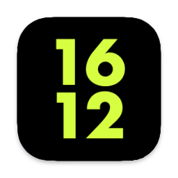

 
# What is NikeDockClock?
Dock Clock designed for macOS, themed off of the Apple Watch Nike Face.
# Compatibility
This app is only compatible with macOS Catalina and later (10.15 - 11.0). Do not request for compatibility with Mojave and earlier as the app will not work properly and the code will never be properly compatible.
# How to install 'NikeDockClock'
Download the [latest release of NikeDockClock](https://github.com/Hanly-Wijaya/NikeDockClock/releases/tag/1.0-alpha-v1) then open the zip file then move the app from the folder path to you're Applications folder. After moving the app, you can open the app and be greeted with a window of 24-hour time. You can close the window and the time will be ticking in the dock. The clock automatically changes. If a message for example, 'App is by an unidentified developer' or 'Cannot open this app', follow the steps in 'Signing Issues'.
# Signing Issues
If you get an message after attempting to open the app and you are not able to open the app, use the command in the Terminal app below without ) or (.

sudo chmod -R 755 (path to app) 

You should be able to open the apps after the command. If it gives you a prompt again with a different message, open the folder of where the app is located with the Finder app and right click on the app then click 'Open' then click 'Open' again. If that doesn't work, add it as an issue on this repository or [contact me](mailto:m4halgita@yahoo.com).
# Responsibility Info
I am not responsible for the damage of you're Mac if it is either corrupted or damaged. No warranty is INCLUDED. If anything happens, fault goes on YOU.
# Support Info
If you need support, please [contact me](mailto:m4halgita@yahoo.com) or make a issue on this repository.
# Extra info for Developers
If you would like a uncompiled copy of this app, please [contact me](mailto:m4halgita@yahoo.com).
# Requests
If you would like to add a request, either send it as an issue or [contact me](mailto:m4halgita@yahoo.com).
# Changelogs
Version 1.0-alpha-v1: Whole new app.
